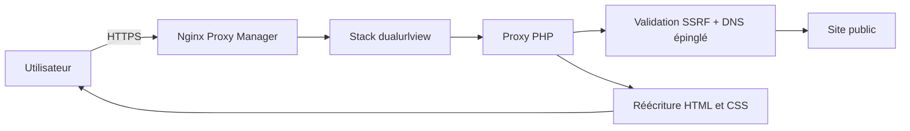

# Duoviewurl

[](CHANGELOG.md)
[](https://www.php.net/)
[](https://developer.mozilla.org/fr/docs/Web/JavaScript)
[](LICENSE)
[](#utilisation)
[](https://github.com/TheLibertyWolf/dualviewurl/actions/workflows/ci.yml)

**Un outil web auto-hébergé pour observer une même URL simultanément dans une vue ordinateur et une vue mobile.**

Duoviewurl charge les pages à travers un proxy HTTP PHP sécurisé. Il peut ainsi appliquer un User-Agent différent par panneau, réécrire les ressources relatives et synchroniser les liens suivis malgré les restrictions habituelles des `iframe` directes.

## Aperçu

L’écran principal est immédiatement utilisable : une barre d’URL, deux panneaux redimensionnables, leurs dimensions réelles et les réglages propres à chaque vue. Sur téléphone, les panneaux sont empilés.

## Fonctionnalités

- ajout automatique de `https://` lorsque le protocole manque ;
- accès protégé par compte, avec session sécurisée et option « Se souvenir de moi » pendant 30 jours ;
- administration des utilisateurs et des clés Cloudflare Turnstile depuis une fenêtre dédiée ;
- historique privé par utilisateur, suggestions pendant la saisie et suppression à la demande ;
- installation en Progressive Web App (PWA) ;
- vues ordinateur et mobile chargées simultanément ;
- séparateur redimensionnable à la souris, au tactile et au clavier ;
- dimensions réelles actualisées en direct ;
- rechargement indépendant et inversion des configurations ;
- presets indépendants par panneau pour desktop, laptop, iPad, iPhone, Pixel et Galaxy, avec largeur réelle et User-Agent adapté ;
- thème système, clair ou sombre par panneau ;
- synchronisation désactivable des liens suivis ;
- sessions distantes temporaires partagées par les deux vues et formulaires POST classiques ;
- effacement immédiat de la session distante depuis le footer ;
- mémorisation locale optionnelle des réglages ;
- partage de la page inspectée avec le paramètre `?url=` ;
- interface responsive, navigation clavier, focus visible et réduction des mouvements ;
- aucune bibliothèque front-end ni ressource CDN obligatoire.

## Architecture



Le serveur valide chaque URL et chaque redirection avant la requête. L’adresse DNS publique retenue est épinglée dans cURL afin d’éviter une seconde résolution non contrôlée. Les détails figurent dans [docs/ARCHITECTURE.md](docs/ARCHITECTURE.md).

## Prérequis

- Docker Engine avec Docker Compose v2 ;
- un réseau Docker `npm_default` partagé avec Nginx Proxy Manager ;
- DNS du domaine pointant vers le serveur ;
- ports 80 et 443 ouverts vers Nginx Proxy Manager.

Pour une installation PHP sans Docker : PHP 8.2 ou supérieur, Apache, cURL et DOMDocument.

## Installation

```bash
git clone git@github.com:TheLibertyWolf/dualviewurl.git
cd dualviewurl
docker compose up -d --build
docker exec -u www-data -it dualviewurl-app php /var/www/html/bin/create-user.php admin 'un-mot-de-passe-long' admin
```

La stack s’appelle `dualurlview`. Elle n’expose aucun port hôte ; Nginx Proxy Manager joint `dualviewurl-app` sur le port interne 80. SQLite est embarqué dans le conteneur et son fichier est conservé dans le volume Docker `dualurlview_data` : il n’existe donc pas de second conteneur de base de données. Voir [docs/DEPLOYMENT.md](docs/DEPLOYMENT.md) pour le Proxy Host et TLS.

## Configuration

| Variable | Défaut | Rôle |
| --- | ---: | --- |
| `DUOVIEW_RATE_LIMIT` | `1200` | requêtes proxifiées maximales par IP et par minute, ressources comprises |
| `DUOVIEW_MAX_BYTES` | `10485760` | taille maximale d’une réponse distante |
| `DUOVIEW_CONNECT_TIMEOUT` | `5` | délai de connexion en secondes |
| `DUOVIEW_TOTAL_TIMEOUT` | `15` | durée totale maximale en secondes |
| `DUOVIEW_DB_PATH` | `/var/lib/dualviewurl/dualviewurl.sqlite` | emplacement de la base SQLite persistante |

## Utilisation

1. Saisir un domaine ou une URL HTTP(S).
2. Choisir le User-Agent et le thème de chaque panneau.
3. Déplacer le séparateur, ou le sélectionner puis utiliser les flèches gauche/droite. `Maj` augmente le pas ; `Début` et `Fin` atteignent les limites.
4. Activer « Mémoriser » uniquement sur un appareil de confiance si la dernière URL doit être conservée.
5. Utiliser « Partager » pour copier une URL contenant la destination encodée.

## Sécurité

L’interface, l’API et le proxy exigent une session authentifiée. Les mots de passe sont hachés avec l’algorithme PHP recommandé, les actions d’écriture sont protégées par jeton CSRF, les connexions sont limitées en débit et les clés Turnstile restent côté serveur.

Le proxy refuse les schémas autres que HTTP(S), les identifiants intégrés, les ports autres que 80/443, les hôtes locaux et toute adresse IPv4 ou IPv6 privée, réservée, loopback, link-local ou multicast. Toutes les réponses DNS sont contrôlées ; une seule adresse interdite fait refuser le domaine. Chaque redirection repasse par le même contrôle.

Les requêtes ont une durée, une taille et un nombre de redirections limités. Les cookies et en-têtes d’autorisation du visiteur ne sont jamais transmis. Les contenus ne sont pas stockés. Les cadres distants sont sandboxés et le conteneur fonctionne en lecture seule avec des capacités Linux supprimées.

Pour permettre l’inspection d’un espace authentifié, les cookies émis par le site distant sont conservés dans un fichier temporaire propre au navigateur, sur le `tmpfs` du conteneur. Ils ne sont jamais envoyés au navigateur ni partagés avec un autre visiteur, expirent après inactivité et disparaissent au redémarrage ou avec « Effacer la session ». Les corps POST ne figurent pas dans les journaux ; l’accès à `proxy.php` est exclu du journal Apache.

Consultez [SECURITY.md](SECURITY.md) avant de signaler une vulnérabilité.

## Limites connues

Un proxy HTML ne peut pas reproduire parfaitement tous les sites. Les formulaires de connexion HTML classiques sont pris en charge. Les vues sont servies depuis l’origine isolée `dualviewurl-view.jessysystem.com` afin que Turnstile, reCAPTCHA et hCaptcha disposent d’une origine valide sans pouvoir accéder à l’interface principale. Le propriétaire du widget doit autoriser ce hostname et son serveur doit l’accepter lors de la validation. Les applications fortement dépendantes de JavaScript, service workers, WebSockets, OAuth externe, MFA, protections anti-bot, téléchargements, formulaires multipart complexes et vérifications strictes de l’origine peuvent rester incompatibles. Les requêtes dynamiques générées dans du JavaScript distant ne sont pas réécrites automatiquement.

La largeur d’un panneau reproduit un viewport, mais pas toutes les caractéristiques matérielles d’un appareil réel. Les outils de développement du navigateur restent la référence pour une émulation complète.

## Tests

```bash
docker build -t duoviewurl:test .
docker run --rm --entrypoint php duoviewurl:test /var/www/html/tests/run.php
```

La suite couvre notamment les URL HTTP(S), ports interdits, identifiants, localhost, plages privées IPv4, plages locales IPv6, résolution DNS mixte, résolution des chemins relatifs, réécriture HTML/CSS, schéma SQLite, réglages persistants et isolation des historiques. GitHub Actions reconstruit l’image, contrôle la syntaxe PHP et exécute ces tests à chaque push et pull request.

## Contribution et support

Lire [CONTRIBUTING.md](CONTRIBUTING.md) avant une pull request. Pour une question d’utilisation, consulter [SUPPORT.md](SUPPORT.md). Les changements publiés sont répertoriés dans [CHANGELOG.md](CHANGELOG.md).

## Auteur

Créé et maintenu par [Arnaud Moine — TheLibertyWolf](https://github.com/TheLibertyWolf).

Distribué sous licence [MIT](LICENSE).
