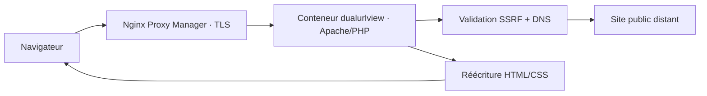

# Architecture

Le navigateur charge l’interface statique puis deux `iframe` isolées par l’attribut `sandbox`. Chaque document et chaque ressource passe par `proxy.php`. Le proxy valide la destination, résout le DNS, refuse toute adresse non publique, épingle l’adresse retenue avec `CURLOPT_RESOLVE`, télécharge avec des limites strictes, puis réécrit les URL HTML ou CSS.

## Frontières de sécurité

- aucun port du conteneur applicatif n’est publié sur l’hôte ;
- seul le réseau externe `npm_default` relie Nginx Proxy Manager à l’application ;
- le système de fichiers du conteneur est en lecture seule et `/tmp` est un `tmpfs` limité ;
- les capacités Linux sont supprimées et `no-new-privileges` est activé ;
- les documents distants restent dans des cadres sandboxés sans `allow-same-origin` ;
- aucun cookie utilisateur, en-tête d’autorisation ou en-tête entrant sensible n’est relayé ;
- les réponses ne sont pas mises en cache.

## Sessions authentifiées

Chaque navigateur reçoit un identifiant aléatoire `HttpOnly`, `Secure` et `SameSite=Lax`. Les cookies des sites distants sont conservés uniquement dans un cookie jar cURL associé, sous `/tmp` en mémoire. Vue A et Vue B partagent ce jar afin d’afficher la même session authentifiée. Les formulaires `application/x-www-form-urlencoded`, JSON et texte sont relayés en POST avec une limite de 2 Mio ; les redirections 301/302/303 repassent ensuite en GET.

Les identifiants restent dans le corps de la requête et ne sont pas journalisés. Les sessions temporaires sont supprimées après deux heures d’inactivité, au redémarrage du conteneur ou à la demande de l’utilisateur.

## Navigation synchronisée

Le proxy ajoute un bridge minimal dans les documents HTML. Il publie au parent la destination absolue d’un lien par `postMessage`. Le parent vérifie la forme de l’URL et charge l’autre panneau lorsque la synchronisation est active. La validation de sécurité définitive reste toujours côté serveur.
